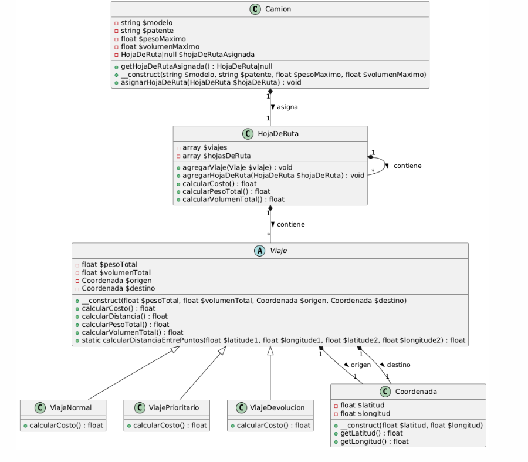

# Transportes
## Basteiro Sabrina

1. **Reporte de Viajes Realizados:**  
Cantidad de Paquetes y Total de Tarifas. Filtrado por viajes con hasta 3 paquetes, con los datos proporcionados la consulta no trae resultados, porque todos los viajes tienen más cantidad de paquetes. Si sacamos esa condición trae los tres viajes con sus respectivos datos.  
[REPORTE EN EL CÓDIGO](./reporte.sql)  
IDE ONLINE PROPORCIONADA:  
https://www.mycompiler.io/view/5ggfqEbNRf8  

2. **Buscador de destinos:**  
No realicé el EXTRA  
[DESTINOS EN EL CÓDIGO](./destinos.php)  
IDE ONLINE PROPORCIONADA:  
https://phpsandbox.io/n/misty-meadow-aqbq-o7ib8

3. **Total adeudado de las facturas no pagadas, por tipo de cliente:**  
[TOTALES EN EL CÓDIGO](./total.js)  
IDE ONLINE PROPORCIONADA:  
https://replit.com/@sbasteiro1/HHRR-Declaratividad

4. **Estructura:**  
Tal como se pidió, se encuentra todo en el archivo [INDEX](./index.php)  
IDE ONLINE PROPORCIONADA:  https://phpsandbox.io/n/black-tion-medon-hsmot#index.php  
EXTRA: Se utilizó `phpdoc` para documentar en el archivo mismo.  
 
Se utilizaron los principios de POO=  
*Herencia* = La clase hija ViajeNormal extiende de la clase Viaje  
*Composición*= La clase tiene instancias dentro de ellas, camión tiene una hoja de ruta.  
*Polimorfismo*=  ViajeNormal, ViajePrioritario, y ViajeDevolucion comparten un mismo método calcularCosto(), tienen el mismo nombre de método pero diferente implementación.

5. **Test Unitarios:**  
Se instaló phpUnit para esto, para ejecutarlo se ingresa php `phpunit.phar`  
[ARCHIVO CAMIONTEST](./tests/CamionTest.php)

6. **Diagrama de clases:**  
